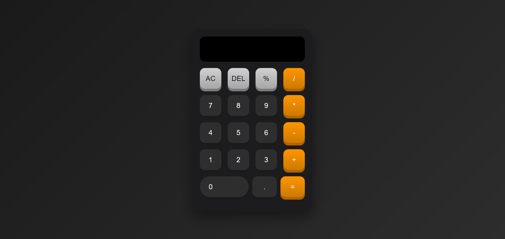

# 🧮 Web Calculator App

A clean, responsive calculator built using **HTML**, **CSS**, **Vanilla JavaScript**, and powered by the **[math.js](https://mathjs.org/)** library for advanced math expression evaluation.

This calculator supports all basic arithmetic operations and has keyboard-like interaction, mimicking real calculator behavior.

---

## 📸 Screenshot

 

---

## 🚀 Features

- ✅ Real-time expression input
- ➕ Basic arithmetic operations: `+`, `-`, `×`, `/`, `%`
- 🧠 Smart evaluation with [math.js](https://mathjs.org/)
- ⌫ Delete and Clear (`DEL`, `AC`)
- 💡 Responsive design for desktop & mobile
- 🎨 Easy to customize (HTML/CSS structure)

---

## 🛠 Technologies Used

| Language / Tool | Purpose                      |
|------------------|------------------------------|
| HTML5            | Structure de la page         |
| CSS3             | Design et mise en page       |
| JavaScript       | Logique de la calculatrice   |
| math.js          | Évaluation avancée des expressions |

---

## 📂 Project Structure
calculator-app/
├── calculator.html # Main HTML file for the calculator
├── README.md # Project documentation
├── css/
│ └── calculator.css # Styles (layout, colors, responsiveness)
├── js/
│ └── calculator.js # JavaScript logic and math.js integration
└── image/
└── screenshot.png # Screenshot image used in the README
